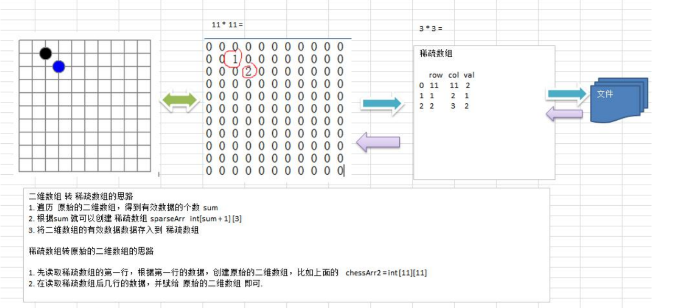
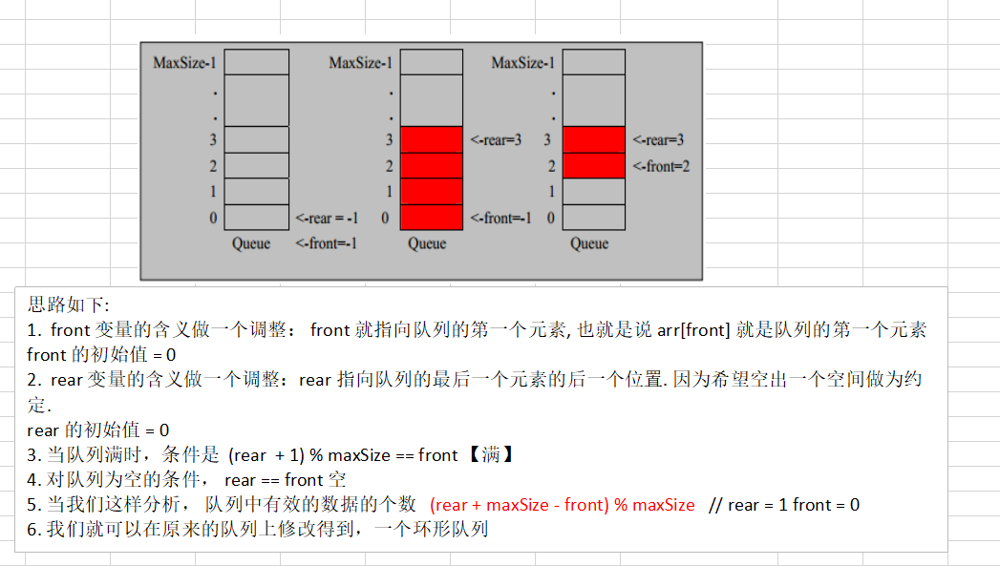
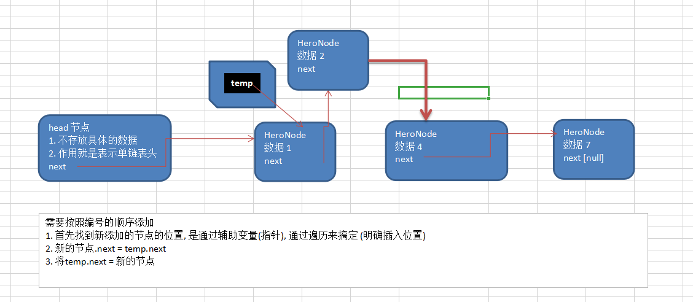

### 稀疏数组

- 当一个数组中大部分元素为0时,或者为同一个值的数组时,就可以使用稀疏数组来保存该数组
- 处理方式
  - 记录数组一共有几行几列，有多少个不同的值
  - 把具有不同值的元素的行列及值记录在一个小规模的数组中，从而缩小程序的规模
- **二维数组 转 稀疏数组**
  - 1. 遍历原始二维数组 确定不同数值个数 COUNT
    2. 创建新的稀疏数组 定义格式为  ++COUNT [3]
    3. 将二维数组有效值存入到稀疏数组中
- 稀疏数组 转 二维数组
  - 1. 创建二维数组 长度 依赖 稀疏数组 第一行记录
    2. 便利读取稀疏数组后几行的数据

**********************
### 队列 [先进先出]
- **front**及 **rear**分别记录队列前后端的下标，**front 会随着数据输出而改变**，而 **rear则是随着数据输入而改变** 
- 单项列表

  - 有限制 队列满后无法更改队列中的值

- 环形队列 
- front跟real的含义做调整 从-1 变为0
  - 当队列满时，条件是  **(rear  + 1) % maxSize == front** 【满】
- 对队列为空的条件， **rear == front** 【空】
  -  队列中有效的数据的个数   **(rear + maxSize - front) % maxSize**   // rear = 1 front = 0 

***************************
### 链表

#### 单链表

- **▷ 新增**
- **尾部追加**
    - 初始化头节点
    - **给定临时遍历节点**(temp) **遍历** [while(true)]**链表** (**找寻条件为 temp.next == null**) 切记 **指向下一位** (否则无法遍历成功)
  
- **插入指定位置**
    - **初始化头节点**
    - **给定临时遍历节点**(temp) 
    - **找寻满足条件的**(temp.next)**节点**
    - **将传入节点的 next == temp.next**
    - **将temp.next = 当前节点**
  

- **▷ 修改**  
- **找到修改节点**
- **▷ 删除**
-  **给定临时遍历节点**(temp)
  -  找到需要删除的节点的前一个节点 (temp.next 的某些规则 匹配上了)
  -  将临时节点的下位 引用为 下下位
- **▷ 查询**

  - **给定临时遍历节点**(temp)
  - 判断临时节点的下个指向 是否为 null  (temp.next == null)

## 面试题
- 链表 QuestionOne
    - 求单链表中有效节点的个数
    - 查找单链表中的倒数第k个节点 
    - 单链表的反转
    - 从尾到头打印单链表 方式1：反向遍历 。 方式2：Stack栈
    - 合并两个有序的单链表，合并之后的链表依然有序

